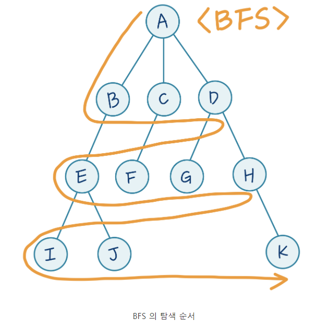

# DFS / BFS

### DFS(깊이우선탐색)

- dfs는 queue가 아닌 stack을 사용
- 기본적으로 최단 거리를 구하는데 적절하지 못한 탐색 방법
- 특정 지점에 처음으로 도달했을 때 거리가 최단이라는 보장이 없음
- just pop()

### BFS(너비우선탐색)

- queue를 사용
- 최단거리를 구하는데 적절
- pop(0) or leftpop

